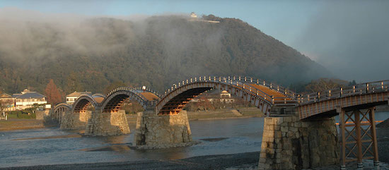
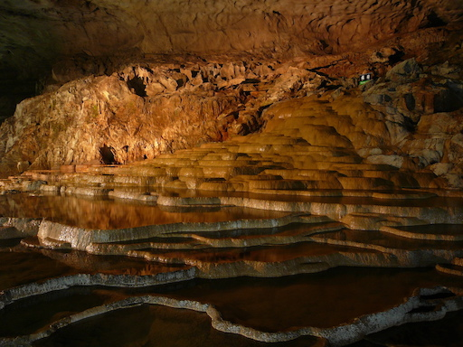
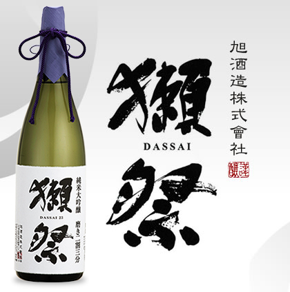

# アイマスハッカソン2017 会議

author
:  treby

# Agenda

* テーマ発表
* コンセプト
  * 例

# テーマ発表

アイマスハッカソン2017のテーマは……

# テーマ

**Did you know?**

# コンセプト

* Did you know?
  * 知識の伝達／知識の享受
  * 知っているようで知らなかった知識・技術
    * 担当アイドルの魅力
    * 技術領域の話

# 例

{:relative_width='100'}

# 例

山口出身

山口といえば……

# 錦帯橋

{:relative_width='100'}

# 秋芳洞

{:relative_width='100'}

# そして何より

{:relative_height='80'}

日本酒が好きなんですね

# チャレンジ

* (継続) アウトプットを求める(メリハリをつける)
* (継続) プロデューサーLT大会
* チーム制の導入、もしくは
* ゆるふわ勢と本気でやる勢の共存が課題

# 日程候補

* 12/2(土)
* 12/3(日)
* 12/9(土)
* 12/10(日)
* 12/16(土)
* 12/17(日)

# 当日の流れ(仮)

* 9:00 集合
* 10:00 オープニング・スタート
* 13:00 お昼ごはん
* 14:00 午後の部スタート
* 17:00 開発終了・発表(作業5.5h)
* 18:00 プロデューサーLT
* 20:00 撤収

# 残タスク

- 日程の決定 …… 今日候補を決めて改めて確定
- 場所の確保: treby …… 日程決まり次第
- イラストの完成: treby
- 配信の手配: bode
- 懇親会の手配: momen

# Discussion
